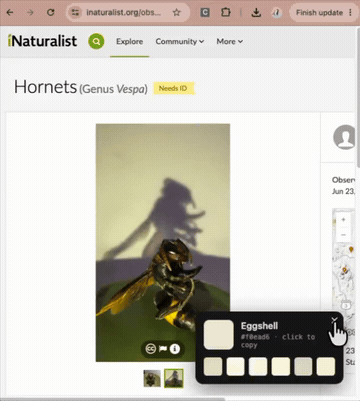

# ColorNamer

A Chrome extension that names colors on-screen. Click the extension then click on the color.

## Install 
Download the folder, then upload the folder to chrome by clicking 'Load Unpacked' at chrome://extensions/ 

> Note: Chrome blocks extensions on special pages (`chrome://`, the Web Store, the new-tab page, PDFs). Use it on any normal website.
